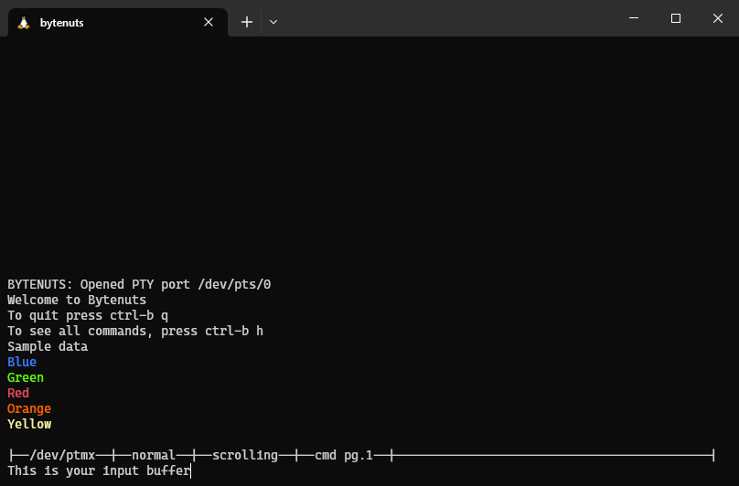

# Important!

This repository has been archived and now lives on GitLab:

https://gitlab.com/CookenMonster/bytenuts


```
██████╗ ██╗   ██╗████████╗███████╗███╗   ██╗██╗   ██╗████████╗███████╗
██╔══██╗╚██╗ ██╔╝╚══██╔══╝██╔════╝████╗  ██║██║   ██║╚══██╔══╝██╔════╝
██████╔╝ ╚████╔╝    ██║   █████╗  ██╔██╗ ██║██║   ██║   ██║   ███████╗
██╔══██╗  ╚██╔╝     ██║   ██╔══╝  ██║╚██╗██║██║   ██║   ██║   ╚════██║
██████╔╝   ██║      ██║   ███████╗██║ ╚████║╚██████╔╝   ██║   ███████║
╚═════╝    ╚═╝      ╚═╝   ╚══════╝╚═╝  ╚═══╝ ╚═════╝    ╚═╝   ╚══════╝
```

Bytenuts aims to be a light weight terminal replacement of GUI based serial communications apps like SecureCRT or ZOC. It allows for simple communication between the PC and serial device.

Bytenuts has been tested and built on x86-64 and 32-bit ARM Ubuntu 18.

## Features

- Input queueing - The input line allows users to edit their command before sending the characters over the serial connection
- XModem transfers - Users can begin an XModem transfer of a file on disc
- 8-bit ANSI color support - 8-bit terminal color can be enabled
- Configuration - Bytenuts can be configured with the config file located at `~/.config/bytenuts/config`
- Input echoing - Bytenuts can echo user input rather than relying on the connected device to echo
- Command history - Simply press up/down arrow to load previous commands
- Output history - Use page up/down, home/end, and ctrl + up/down arrow to scroll through the output window
- Output logging - Output can be saved to a log file passed in with the `-l` option
- Quick commands - Pages of quick commands are loaded from `~/.config/bytenuts/commands[1-10]`
- Session resumption - Bytenuts can load the previous instance's commands and serial output

Sample screenshot running in Windows Terminal and WSL:



## Launch Options

Launching Bytenuts like `bytenuts -h` provides this help print:

```
USAGE

bytenuts [OPTIONS] <serial path>

Configs get loaded from ${HOME}/.bytenuts/config (if file exists)

 OPTIONS
=========

-h
    Show this help.

-b <baud>
    Set a baud rate (default 115200).

-l <path>
   Log all output to the given file.

-c <path>
   Load a config from the given path rather than the default.

-r|--resume
    Resume the previous instance of bytenuts.

--colors=<0|1>
    Turn 8-bit ANSI colors off/on.

--echo=<0|1>
    Turn input echoing off/on.

--no_crlf=<0|1>
    Choose to send LF and not CRLF on input.

--escape=<char>
    Change the default ctrl+b escape character.

--inter_cmd_to=<ms>
    Set the intercommand timeout in milliseconds (default is 10ms).

--time_fmt=<fmt>
    Time format as used by strftime to prepend to every log line.
```

## Navigation

Controls like backspace, delete, end/home, and left/right arrow work as expected within the input buffer window. For the output window, you can use the following keys to scroll through it:

- `ctrl + up/down arrow` - Scroll the output window up or down by one line
- `page up/down` - Scroll the output window up or down by half of the height of the output window
- `shift + home/end` - Jump to the beginning or the end of the output

If the output window reaches the current line of output, then the output will continue scrolling in real time. Otherwise, the output is paused to continue viewing where you currently are.

## Configuration File

Many of the launch options have a corresponding configuration token that can be saved to a config file. Each config is defined like `<name>=<value>`. Here is a sample config:

```
colors=1
echo=0
no_crlf=0
escape=a
inter_cmd_to=100
time_fmt=%X %m/%d %Z|>
```

- `colors` - enable parsing of 8-bit ANSI color codes
- `echo` - echo input to the terminal in app
- `no_crlf` - just send a line feed (`\n`) for user input rather than carriage return + line feed (`\r\n`)
- `escape` - change what character is used as an escape sequence for commands (e.g. if set to `escape=a`, Bytenuts can be exited with `ctrl+a, q`)
- `inter_cmd_to` - Set a timeout in milliseconds that must be met. Useful for pasting in multiple lines and ensuring a short delay in between the commands.
- `time_fmt` - The time format string (see `man 3 strftime`) to be prepended to every line in the log file (will not get printed in the console view)

Bytenuts looks for the configs at `~/.config/bytenuts/config`.

## Commands

Upon starting bytenuts you get this prompt:

```
Welcome to Bytenuts
To quit press ctrl-b q
To see all commands, press ctrl-b h
```

The help prompt lists the available commands.

```
Commands (lead with ctrl-b):
  c: print available quick commands
  0-9: load the given quick command (0 is 10)
  p: select a different quick commands page
  i: view info/stats
  x: start XModem upload with 128B payloads
  X: start XModem upload with 1024B payloads
  H: enter/exit hex buffer mode
  h: view this help
  q: quit Bytenuts
```

### Hex Buffer Mode
When the `ctrl+b H` command has been issued for the first time, you will enter hex buffer mode. In this mode, the input buffer is interpreted as a hex string and will be converted to its byte equivalent before it gets sent to the target. Example inputs:

- `746573740d0a` gets sent as `test\r\n`
- `d0a` gets sent as `\r\n` as it assumed the leading `0` has been omitted
- `74657374xd0a` gets sent as `test` since the `xd` byte contains an invalid hex character

Hex buffer mode can be turned off with a second `ctrl+b H`.

## Quick Commands

You can provide multiple pages of quick commands you can easily load in with `ctrl+b [0-9]` in the files `~/.config/bytenuts/commands<idx>`. Bytenuts will load pages starting from `commands1` until a `commands<idx>` no longer exists. The commands should be newline separated. When a command is loaded, the entire contents of the line is loaded into the input buffer.

Bytenuts will only store the first ten commands for each page, so the first 10 lines of your command files will be used.

On startup, command page 1 is selected. You can select which command page is currently loaded by doing `ctrl+p, [0-9]` to load the desired page (note that index 0 will correspond to `commands10`).

## Session Resumption

Bytenuts caches the current instance's command list and output buffer in `~/.config/bytenuts/inbuf.log` and `~/.config/bytenuts/outbuf.log` respectively. If launched with the `-r` flag, Bytenuts will load in the input and output history from those files. The `outbuf.log` can also serve as a backup log if one forgot to launch with the `-l` flag.

While Bytenuts is running, the process will be writing its backup output and input to `~/.config/bytenuts/outbuf.<pid>.log` and `~/.config/bytenuts/inbuf.<pid>.log` and rename those files to the paths without the PID upon exit. This allows for multiple processes to be open without writing to the same log files. Thus, the `-r` flag will load the most recently exited Bytenuts instance.

## Bugs

Check out known bugs in the [issues tab](https://github.com/cookthebook/bytenuts/issues?q=is%3Aissue+is%3Aopen+label%3Abug).

## Building

Building Bytenuts is very simple. All you need is clang and libncurses (`sudo apt install clang libncurses5-dev`). Run `make` in the Bytenuts root directory to build. You can also install the build (creating a link in `/usr/local/bin` to the `build` directory) by running `sudo make install`.
